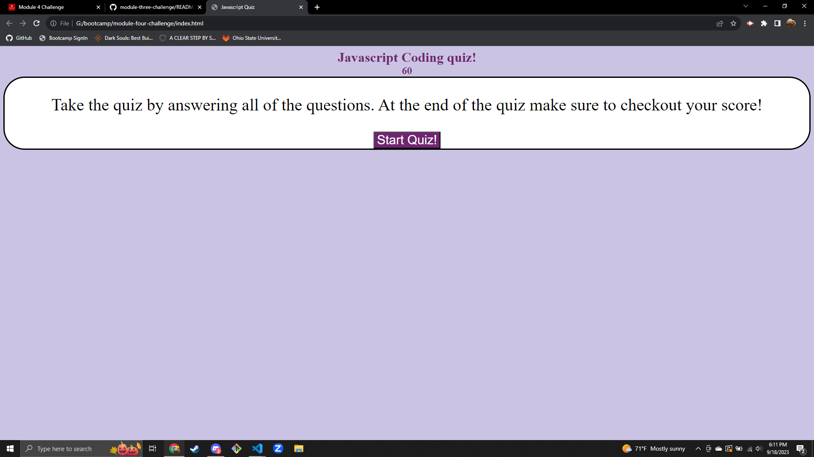

# module-four-challenge

## Description

The finished solution for the challenge included in module 4. The website is a Javascript quiz

## Screenshot

## Deployment link:

https://silverfoot42.github.io/module-four-challenge/

## Credits

The development of this portion of code was assisted by the AI learning assistant on bootcampspot:

for (var i = 0; i < answerButtons.length; i++) {
    answerButtons[i].addEventListener("click", function(event) {
        var selectedAnswer = event.target.textContent;
        var correctAnswer = answers[x-1];
        if (selectedAnswer === correctAnswer) {
            result.textContent = "Correct";
            score = score + 20
        } else {
            result.textContent = "Incorrect";
            timerCount = timerCount - 5;
        }
        renderQuestion();
    });
}